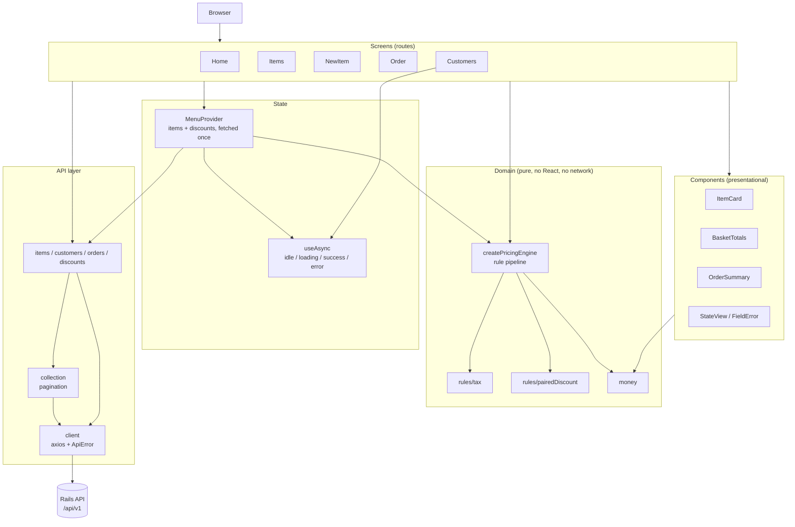
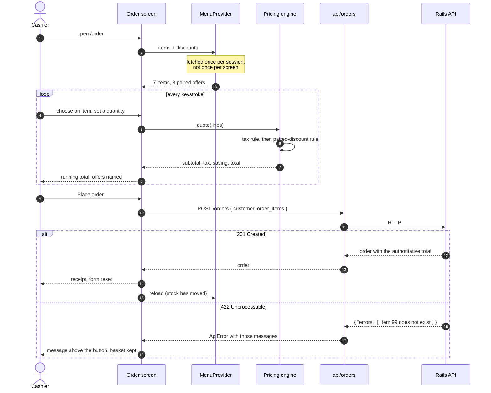

# Agnos Coffee Shop — storefront

A React till for a coffee shop. It reads the menu, prices a basket with
per-item tax and "buy these two together" offers, places the order and shows the
receipt the API returns.

It is the front end for `agnos-coffee-shop-be`, a Rails JSON API. The pricing rules are mirrored here so the total is visible
while the order is being typed; the server's figure is still the one the
customer is charged.

## Screenshots

Captured at 1440×900 against a production build, with the API stubbed from
`src/test/seed.json` — the same rows the test suite asserts against and the
same rows `rails db:seed` creates in the API repository. Re-capture them with
`npm run screenshots` (see [Development](#development)).

| The shop                                       | The menu                                               |
| ---------------------------------------------- | ------------------------------------------------------ |
|              |                      |
| Today's offers, read from `/api/v1/discounts`. | Price, tax, stock and the offer attached to each item. |

| Taking an order                                                                                                   | The receipt                                           |
| ----------------------------------------------------------------------------------------------------------------- | ----------------------------------------------------- |
|                                                                 |  |
| A flat white and a croissant: $6.90 of shelf price, $0.58 of tax, $0.70 off because the two were bought together. | What the API charged, item by item.                   |

## Architecture



Dependencies point inward. Screens know about components, state and the API
layer; the API layer knows about HTTP and nothing about React; the domain knows
about neither and is the part with the arithmetic in it.

## Placing an order



## Quickstart

```bash
npm install
npm start                     # http://localhost:3000
```

The app expects the API at `http://localhost:3001/api/v1`. To run it, follow the
quickstart in `agnos-coffee-shop-be` and seed it with `rails db:seed` — that
creates the menu and the paired offers these screenshots show.

The app runs without the API: every screen shows a readable error with a retry
rather than a blank page.

With Docker (the daemon is not running in this environment, so the image has
been authored but not built):

```bash
docker compose up --build     # http://localhost:3000
```

## Configuration

| Name                       | Required | Default                        | Purpose                                                                                                                                                                                                 |
| -------------------------- | -------- | ------------------------------ | ------------------------------------------------------------------------------------------------------------------------------------------------------------------------------------------------------- |
| `REACT_APP_API_BASE_URL`   | no       | `http://localhost:3001/api/v1` | Where the Rails API is. Baked into the bundle at build time.                                                                                                                                            |
| `REACT_APP_API_TIMEOUT_MS` | no       | `10000`                        | How long a request may take before it fails as a timeout.                                                                                                                                               |
| `PORT`                     | no       | `3000`                         | Dev-server port, read by Create React App.                                                                                                                                                              |
| `API_BASE_URL`             | no       | —                              | **Container only.** Read by `docker/entrypoint.sh`, written into `config.js` at start-up, and takes precedence over the value compiled in. This is what lets one image serve more than one environment. |
| `WEB_PORT`                 | no       | `3000`                         | Host port the compose service publishes.                                                                                                                                                                |

Copy `.env.example` to `.env.local` for local overrides. Nothing here is a
secret: a Create React App bundle is public, so a `REACT_APP_*` variable is
visible to anyone who opens the page. There is no authentication in this API.

## Development

```bash
npm start            # dev server with hot reload
npm test             # jest in watch mode
npm run test:ci      # one run, non-interactive
npm run lint         # eslint, zero warnings tolerated
npm run format       # prettier over the repository
npm run build        # production bundle into build/
```

Re-capturing the screenshots needs a server to point at:

```bash
npm run build
npx serve -s build -l 8541
npm run screenshots -- http://localhost:8541
```

Real captured output from these commands — the test run, coverage, lint, and the
before/after bundle figures — is in
[docs/build-and-test.md](docs/build-and-test.md). The bugs that were found and
what they looked like before the fix are in
[docs/bug-reproductions.md](docs/bug-reproductions.md).

### Testing approach

Tests run against an [`msw`](https://mswjs.io) mock of the Rails API, configured
with `onUnhandledRequest: 'error'`: a request to an endpoint nobody has mocked
fails the suite rather than quietly trying to reach a real server. Mocking at
the network boundary rather than mocking the `axios` module keeps the URL the
client builds, the query string it sends and the envelope it unwraps under test.

`src/test/seed.json` holds the fixture data. The screenshot script reads the
same file, so the pictures in this README and the assertions in the suite cannot
drift apart.

## Project structure

```
src/
  api/                  everything that talks to the network, and nothing else
    client.js           axios instance, base URL resolution, ApiError mapping
    collection.js       pagination: fetchPage for a screen, fetchAll for the menu
    items.js  customers.js  orders.js  discounts.js
  domain/               pure business logic: no React, no network, no I/O
    pricing.js          the rule pipeline, mirroring Pricing::Calculator
    money.js            rounding to whole cents, currency and rate formatting
    rules/              tax.js, pairedDiscount.js -- one file per offer
  context/
    MenuProvider.jsx    items + discounts fetched once and shared
  hooks/
    useAsync.js         idle / loading / success / error, with abort
  components/           presentational, reusable, no data fetching
  screens/              one per route
  styles/theme.css      the coffee palette layered over Bootstrap
  test/                 msw handlers, fixtures, render helper
docker/                 nginx config and the runtime-config entrypoint
docs/                   captured output and screenshots
scripts/                screenshot capture
```

## Design notes

**The pricing rules live in the client as well as the server.** A till that only
learns the price after the order is submitted is not a till. `src/domain/pricing.js`
is a deliberate mirror of `Pricing::Calculator` in the API repository: the same
rules in the same order, tax on the shelf price first and the paired discount off
the taxed figure, with the line rounding done the same way (the unrounded unit
price is multiplied by the quantity before the line is rounded, so two espressos
at 2.625 come to 5.25 and not 5.26). The tests assert the figures the API's own
documentation publishes. The server's total is still authoritative — the client
never sends a price, only item ids and quantities.

**One rule pipeline is the extension point.** Adding an offer — happy hour, a
loyalty tier, buy-one-get-one — means writing one object with
`{ name, apply(unitPrice, line, basket) }` and adding it to the list in
`createMenuPricingEngine`. No existing rule changes and no screen changes;
`src/domain/pricing.test.js` demonstrates this by pricing a basket through a
loyalty rule that exists only inside the test. The same seam is the reason the
discount table is fetched rather than hardcoded.

**The API layer owns failure.** `api/client.js` is the only module that imports
axios, and it converts everything axios can throw — a 422 with the API's own
messages, a 500, a timeout, a refused connection — into an `ApiError` with a
message worth showing a person. Before this pass the layer called
`alert(error.message)` and returned `undefined`, which the caller then
dereferenced; every API failure was an alert box followed by a white screen.

**Layers, and which way they point.** Screens compose components and read state;
the API layer knows HTTP and not React; the domain knows neither. That is what
makes the money testable without a browser: `money.test.js` and `pricing.test.js`
never render anything.

**Scalability, honestly.** This is a small client and the bottlenecks are small
and specific:

- _Unbounded lists._ The API paginates and returns `meta.total_pages`; the
  original client sent no page parameters and read only the array, so the menu
  silently stopped at 25 items and the customer list showed only the newest 25
  with nothing on screen to say so. `fetchAll` follows `total_pages` for the two
  collections that are genuinely bounded (the menu and the offers), with a hard
  cap of 20 pages so a misbehaving API cannot spin the browser, and the customer
  list — the one that grows without limit — is paged in the UI instead.
- _Duplicate fetching._ The menu was fetched again on every navigation between
  the items screen and the order screen, with a flash of "No Data Retrieved" in
  between. `MenuProvider` fetches it once per session and mutations update the
  cached copy in place.
- _Bundle size._ 135.19 kB → 109.08 kB gzipped, a 19.3% reduction, mostly from
  removing a Bootstrap JavaScript bundle that `react-bootstrap` never used.
  Figures and method in [docs/build-and-test.md](docs/build-and-test.md).
- _In-flight requests are aborted._ `useAsync` cancels the previous request when
  it re-runs, so paging quickly through customers cannot land an old page on top
  of a new one.

**One image, many environments.** A Create React App bundle inlines
`process.env.REACT_APP_*` at compile time, which normally means rebuilding to
change an API URL. `public/config.js` is read at runtime and takes precedence;
the container entrypoint rewrites it from `API_BASE_URL` before nginx starts.

## Limitations

- **No authentication.** The API has none, so neither does this. Anyone who can
  reach the page can delete a menu item.
- **Orders cannot be browsed.** The API exposes `GET /api/v1/orders`, but there
  is no screen for order history; the receipt is shown once, when the order is
  placed.
- **Items cannot be edited.** They can be added and removed. The API supports
  `PUT /api/v1/items/:id`; the UI does not use it.
- **Stock is displayed, not enforced.** The card shows how many are left and
  flags anything at 25 or fewer, but the order form will let you ask for more
  than that and rely on the API to refuse.
- **The client-side total is a preview.** It mirrors the server's rules, and the
  tests pin it to the figures the API publishes, but if the two ever diverge the
  server wins and the receipt will differ from the running total.
- **Delete is not confirmed.** "Remove from menu" takes effect immediately.
- **The Docker image has not been built.** It is authored and
  `docker compose config` parses, but the daemon was unavailable in this
  environment, so neither the build nor the boot has been verified.
