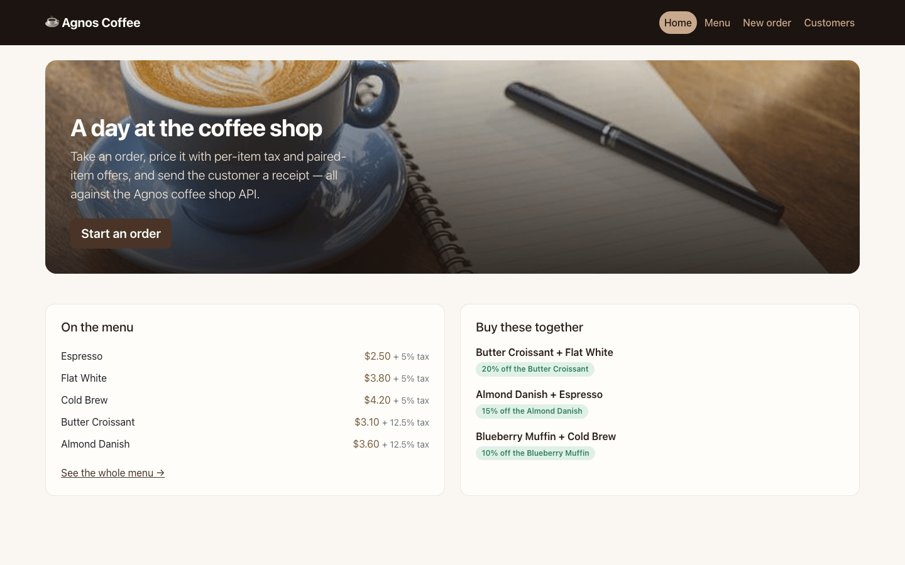
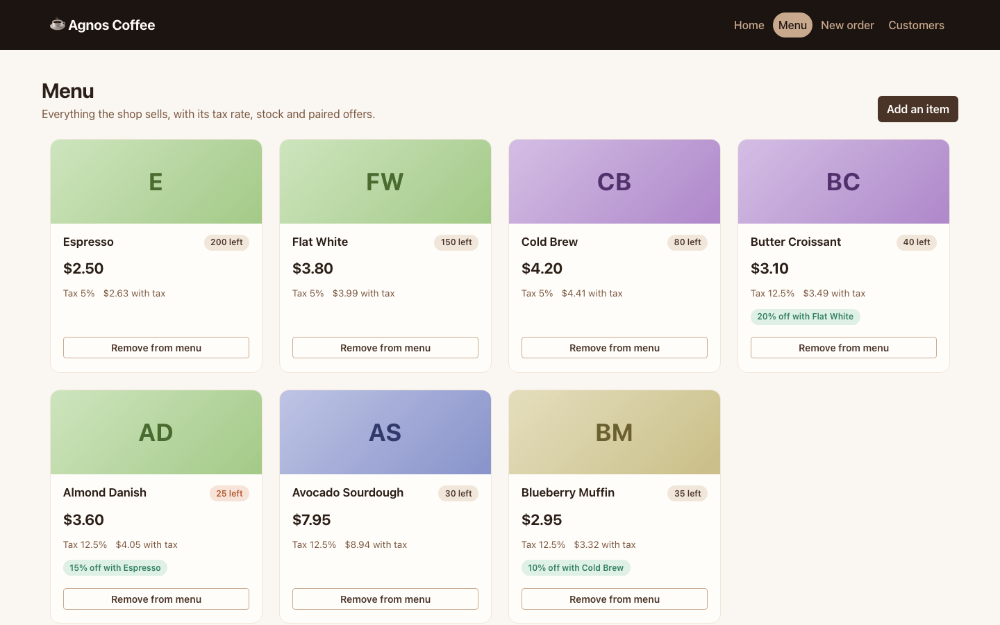
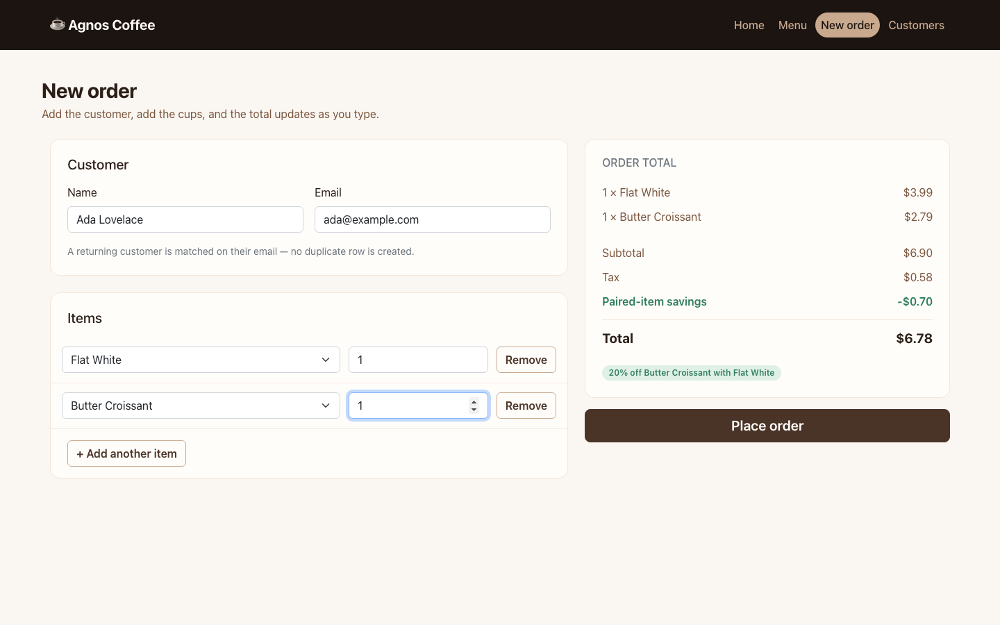
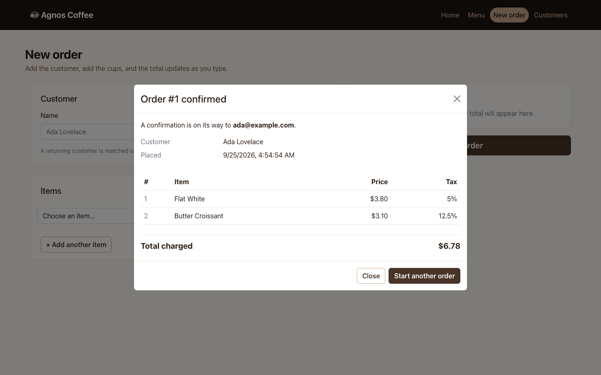
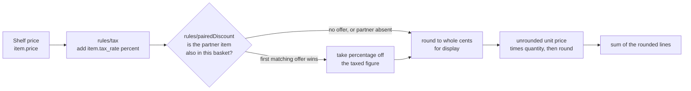
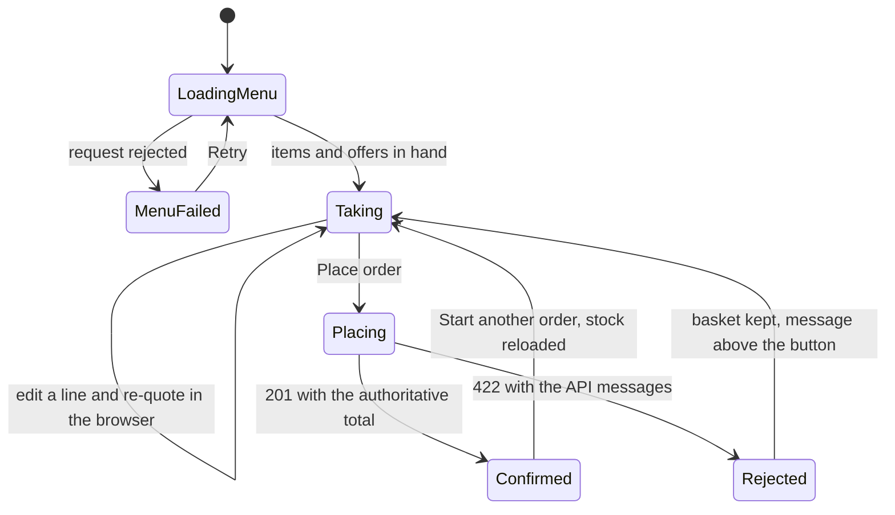

# Agnos Coffee Shop — the till

A React front end for a coffee shop counter. It loads the menu, prices a basket
with per-item tax and "buy these two together" offers **while the cashier is
still typing**, posts the order, and shows the receipt the API returns.

The API is the sibling repository `agnos-coffee-shop-be` (Rails 6, JSON, no UI).
This repository holds no database and no server of its own — every row it shows
comes from `/api/v1`.

## What the cashier sees

Captured at 1440×900 against a production build, with every `/api/v1` request
fulfilled from [`src/test/seed.json`](src/test/seed.json) — the same fixture the
test suite asserts against, so the pictures and the tests cannot drift apart.
Re-capture with `npm run screenshots` (see [Working on it](#working-on-it)).

| The shop front                                                                      | The menu                                                                                    |
| ----------------------------------------------------------------------------------- | ------------------------------------------------------------------------------------------- |
|                                                   |                                                           |
| Five of the seven items, and the three paired offers read from `/api/v1/discounts`. | Every item with its tax rate, its tax-inclusive price, stock, and the offer attached to it. |

| Taking an order                                                                                                                                                     | The receipt                                                     |
| ------------------------------------------------------------------------------------------------------------------------------------------------------------------- | --------------------------------------------------------------- |
|                                                                                                                   |            |
| A Flat White and a Butter Croissant: $6.90 shelf, $0.58 tax, $0.70 off because the two are in the same basket — totalled in the browser, before anything is posted. | The total the API actually charged, with the lines it recorded. |

## The same prices, computed twice

This is the interesting thing about this repository, and the thing to look at
first. A till that only learns the price _after_ the order is submitted is not a
till, so `src/domain/` re-implements the server's pricing pipeline in the
browser. `src/domain/pricing.js` is a deliberate mirror of the API's
`Pricing::Calculator`, rule for rule:



Both sides agree on all four decisions that make this pipeline what it is: tax
goes on the shelf price and the discount comes off the **taxed** figure, not the
shelf one; the offer is **directional** (`item_id` gets cheaper,
`discount_with_item_id` must merely be present); **at most one** offer applies
per line, first match wins; and the offer is **quantity-blind**, so one Flat
White discounts every croissant on the line. The line is rounded once, from the
unrounded unit price — two espressos at 2.625 come to 5.25, not 5.26.

A rule is just `{ name, apply(unitPrice, line, basket) }` and
`createMenuPricingEngine(discounts)` composes the list, which is the same seam
the backend chose. `src/domain/pricing.test.js` demonstrates it by pricing a
basket through a `loyaltyRule` that exists only inside the test.

**The server's total is still the one that counts.** The client never sends a
price — only item ids and quantities. The two implementations can nevertheless
disagree, in two places; both are in [Known gaps](#known-gaps) with the
arithmetic.

## What a screen goes through

Every screen runs on one hook, `useAsync`, which is a four-state machine with an
`AbortController` behind it: a superseded request is cancelled, so paging
quickly through customers cannot land an old page on top of a new one. The order
screen adds the submit branches:



The menu and the offers are fetched **once per session** by
`src/context/MenuProvider.jsx` and shared by three screens, not re-fetched per
navigation. `api/client.js` is the only module that imports axios and the only
one that knows what failure looks like: it turns a 422 into an `ApiError`
carrying the API's own `{"errors": [...]}` strings — for a bad basket that is
`One or more of the requested items do not exist.` — and a timeout or a refused
connection into a sentence worth showing a person.

## Run it

```bash
npm install
npm start                      # http://localhost:3000
```

The app expects the API at `http://localhost:3001/api/v1`. Follow the quickstart
in `agnos-coffee-shop-be` and run `rails db:seed`; that creates exactly the menu
and the three paired offers in the screenshots above.

Without the API the app still runs — every screen shows a readable error with a
Retry rather than a blank page.

A multi-stage image (node build → nginx, non-root, port 8080) and a compose file
are committed:

```bash
docker compose up --build      # http://localhost:3000
```

Neither has been exercised: the repository's own uplift report records **`Build
verified: NOT RUN — deferred, Docker off`** and **`Boot verified: NOT RUN —
deferred, Docker off`**. `docker compose config` is the only check that has been
run against it.

## Where the API lives

| Name                       | Default                        | What it does                                                                                                                                                                                       |
| -------------------------- | ------------------------------ | -------------------------------------------------------------------------------------------------------------------------------------------------------------------------------------------------- |
| `REACT_APP_API_BASE_URL`   | `http://localhost:3001/api/v1` | API base URL, baked into the bundle at build time.                                                                                                                                                 |
| `REACT_APP_API_TIMEOUT_MS` | `10000`                        | How long a request may take before it fails as a timeout.                                                                                                                                          |
| `PORT`                     | `3000`                         | Dev-server port, read by Create React App.                                                                                                                                                         |
| `API_BASE_URL`             | —                              | **Container only.** `docker/entrypoint.sh` writes it into `public/config.js` at start-up, and that wins over the value compiled in — which is what lets one image serve more than one environment. |
| `WEB_PORT`                 | `3000`                         | Host port the compose service publishes.                                                                                                                                                           |

Copy `.env.example` to `.env.local` for local overrides. **Nothing here is a
secret and nothing here may become one:** a Create React App bundle is public, so
any `REACT_APP_*` value is readable by anyone who opens the page. This API has no
authentication anyway.

## Working on it

```bash
npm run test:ci      # one non-interactive run
npm run lint         # eslint, zero warnings tolerated
npm run format       # prettier over the repository
npm run build        # production bundle into build/
```

The current build is **109.08 kB of gzipped JavaScript and 29.16 kB of CSS**.

Tests run against an [`msw`](https://mswjs.io) mock of the Rails API with
`onUnhandledRequest: 'error'`, so a call to an endpoint nobody has mocked fails
the suite instead of quietly reaching for a real server. Mocking at the network
boundary rather than stubbing the axios module keeps the URL, the query string
and the envelope the client unwraps all under test. Captured output from a run —
tests, coverage, lint — is in [docs/build-and-test.md](docs/build-and-test.md);
the reproductions behind the fixed bugs are in
[docs/bug-reproductions.md](docs/bug-reproductions.md).

Re-capturing the screenshots needs something to point at:

```bash
npm run build
npx serve -s build -l 8541
npm run screenshots -- http://localhost:8541
```

```
src/
  domain/      pure arithmetic: no React, no network, no I/O
    pricing.js   the rule pipeline    money.js  cent rounding and formatting
    rules/       tax.js, pairedDiscount.js -- one file per offer
  api/         the only code that talks to HTTP
    client.js    axios instance, base URL resolution, ApiError mapping
    collection.js  pagination: fetchPage for a screen, fetchAll for the menu
    items.js  customers.js  orders.js  discounts.js
  context/     MenuProvider.jsx -- items + offers, fetched once
  hooks/       useAsync.js -- the four states above, with abort
  components/  presentational only      screens/  one per route
  test/        msw handlers, fixtures, render helper
docker/  nginx config and the runtime-config entrypoint
docs/    captured output and the four screenshots
```

Dependencies point inward. Screens know about components, state and the API
layer; the API layer knows HTTP and nothing about React; `domain/` knows neither,
which is why `money.test.js` and `pricing.test.js` render nothing at all.

## Known gaps

- **The browser and the server can round a line differently.** Both compute in
  floats, and for a Flat White and a croissant both land on $6.78. But
  `domain/money.js` nudges by a relative epsilon before rounding, and Ruby's
  `Float#round(2)` does not. Take an item at $0.15 with 12.5% tax and a 20%
  pair: both arrive at `0.13499999999999998`, Ruby rounds it to **0.13** and
  `roundMoney` returns **0.14**. Sweeping 56,000 combinations of shelf price,
  the tax rates on this menu, seven discount percentages and four quantities
  through both disagrees on 544 unit prices and 735 line subtotals — roughly 1%,
  always by one cent. The receipt shows the server's figure, so the customer is
  charged correctly, but the running total above it can be a cent out.
- **If an item ever carries two applicable offers, the two sides may not pick
  the same one.** Both take the first match. The server iterates the item's
  `discounts` association in whatever order the database returns it, while this
  client iterates `/api/v1/discounts`, which the API sorts `created_at DESC, id
DESC`. Today's seed gives each item at most one offer, so it cannot bite yet.
  Pinning an order on both sides would fix it.
- **No authentication**, because the API has none. Anyone who can reach the page
  can delete a menu item, and the delete is not confirmed first.
- **Orders cannot be browsed.** `GET /api/v1/orders` exists; there is no history
  screen, so the receipt is shown once and then it is gone.
- **Items cannot be edited**, only added and removed, though the API offers
  `PUT /api/v1/items/:id`.
- **Stock is displayed, not enforced.** The card shows what is left and flags
  anything at 25 or fewer, but the order form will happily ask for more and let
  the API refuse it.
- **Create React App 5 is end-of-life.** Migrating to Vite is the right call for
  a living product and the wrong one for a take-home, where it would bury the
  diff.
